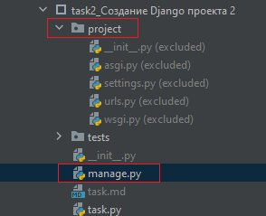

Теперь создадим проект но развернём его прямо в папке.

Для этого перейдём в нужную папку с помощью команды `cd`

Мы уже находимся в папке прошлого задания(task1_...)

Теперь перейдём в текущее задание, для этого вернёмся в директорию выше использовав команду `cd ..` в консоли

Затем перейдём в нужную папку использовав команду `cd task2_Создание Django проекта 2`

И уже в данной папке создадим проект `django-admin startproject project .`

Обратите внимание что в команде появилась точка, которая указывается что проект разворачивается в папке

Можно увидеть, что проект создался.

