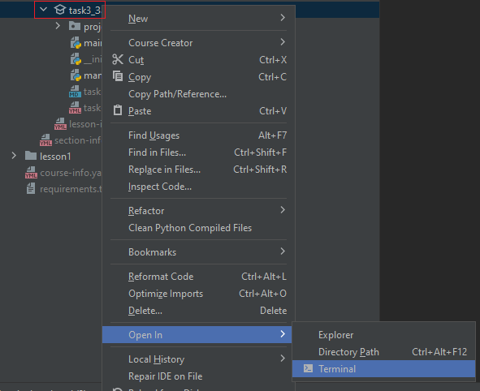
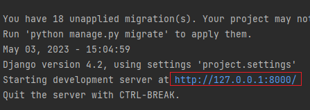
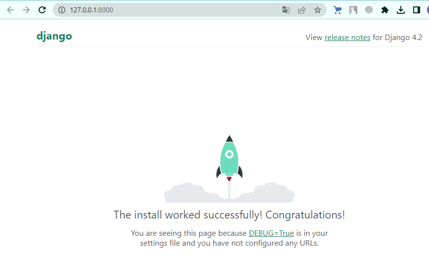
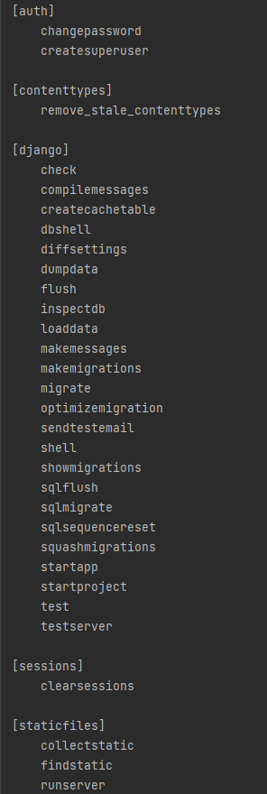

Для запуска проекта используем консольную команду `python manage.py runserver`
Однако помним, что запуск нужно производить из папки проекта, где содержится управляющий файл `manage.py`.

Во всех остальных примерах будут использоваться проекты разверные прямо в корне папки с задачей. Т.е. достаточно вызвать команду из корня задачи.

Чтобы быстро открыть консоль с необходимым путём достаточно щелкнуть правой кнопкой мыши на нужной папке, далее Open in -> Terminal так откроется консоль с необходимой рабочей папкой.

После запуска команды в консоли появится ссылка, если на неё нажать, то откроется браузер со стартовой страницей Django

Чтобы остановить сервер с приложением, то в консоле, где запущен сервер необходимо нажать комбинацию ``Ctrl+C``

Также чтобы посмотреть все доступные команды у manage.py, то можно прописать 

`python manage.py -h`

