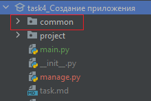

Для создания нового приложения в проекте в консоле необходмо прописать команду
`python manage.py startapp <название вашего приложения>`

Создайте приложение **common**

Не забудьте перейти в консоль по нужному пути, а именно task4_Создание приложения

`python manage.py startapp common`

Если всё будет верно, то появится новая папка **common**

