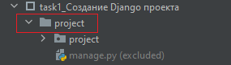

Заходим в консоль (Terminal). 

Далее необходимо вызвать команду (пока не вызываем!) `django-admin startproject <имя проекта>` 

Однако рабочая папка у нас стоит корневая ...\PywebDjango

Сначала перейдём в папку в которой будем разворачивать проект

Для этого перейдём в нужную папку с помощью команды `cd`

Пропишем в консоли `cd Урок1/Создание проекта/task1_Создание Django проекта`

Теперь наш путь будет в виде ...\PywebDjango\Урок1\Создание проекта\task1_Создание Django проекта

И уже в данной папке создадим проект `django-admin startproject project`

Можно увидеть, что проект создался.

Имя проекта можно выбрать любое, однако, чтобы в будущем тесты проходили правильно в EduTools, то лучше их называть как в примере.
На практике разработчик сам выбирает какое будет имя у проекта.

